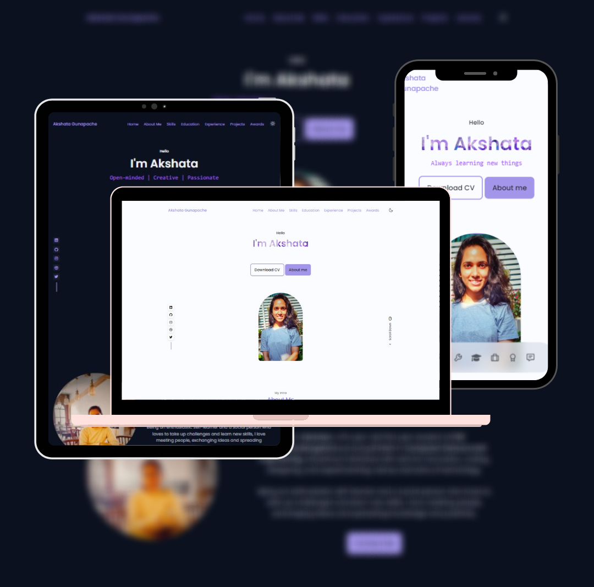

<h1>Personal Portfolio Website</h1>

<h2>
  <a href="https://akshata-gunapache.github.io/">akshata-gunapache.github.io</a>
</h2>

  

## Features 📋

⚡️Responsive Portfolio Website Using HTML CSS & JavaScript
⚡️Smooth scrolling in each section.
⚡️Includes a dark and light mode.
⚡️Developed first with the Mobile First methodology, then for desktop.
⚡️Compatible with all mobile devices and with a beautiful and pleasant user interface.

## Sections 📚

✔️ Home\
✔️ About\
✔️ Skills \
✔️ Education \
✔️ Experience \
✔️ Projects\
✔️ Awards\
✔️ Contact\
✔️ Footer

## Tools Used 🛠️

- [**GitHub Pages**](https://docs.github.com/en/pages) - To host my static website (HTML, CSS, JS).
- [**Google Fonts**](https://fontawesome.com/) - Great typography and iconography.
- [**Dopely**](https://colors.dopely.top/) - Amazing color palettes, gradients, and color-types!
- [**Boxicons**](https://iconscout.com/unicons) - Simple and beautiful Open Source icons.
- [**Swiper.js**](https://swiperjs.com/) - JavaScript Library
- [**Mixitup.js**](https://www.kunkalabs.com/mixitup/) - A high-performance, dependency-free library for animated filtering, sorting, insertion, removal ,etc.

## Contributing

Contributions are what make the open source community such an amazing place to be learn, inspire, and create. Any contributiors who wants to make this website better can make contribution,which will be **greatly appreciated**.

1. Fork the Repo or Clone it to your local machine.
2. Create your Feature Branch (`git checkout -b feature/AmazingFeature`)
3. Commit your Changes (`git commit -m 'Added some AmazingFeature'`)
4. Push to the Branch (`git push origin feature/AmazingFeature`)
5. Open a Pull Request

